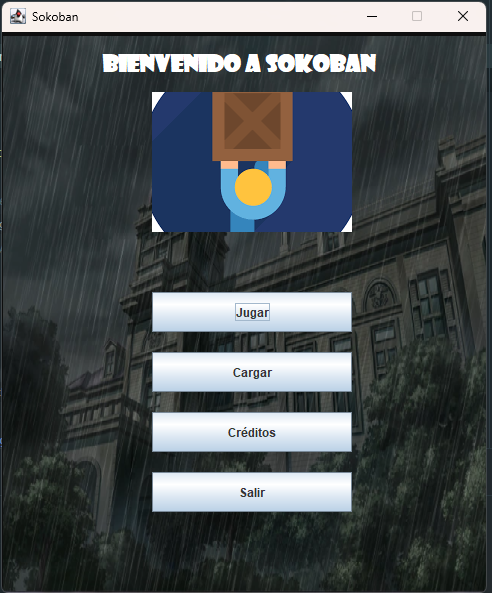
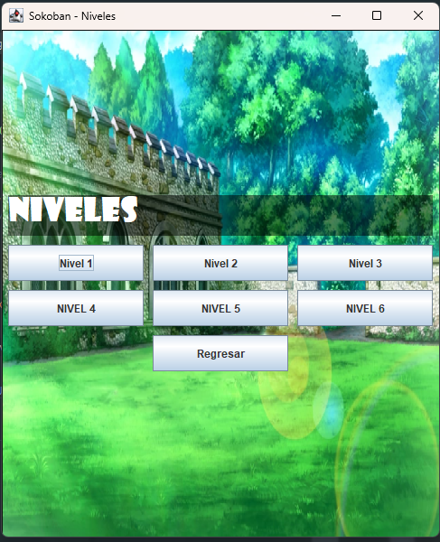
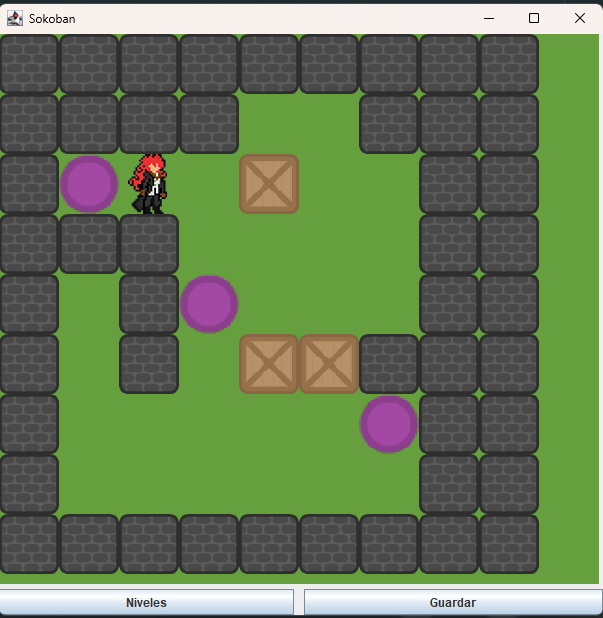

# Sokoban Game

¡Bienvenido al proyecto de Sokoban! Este es un juego clásico de rompecabezas en el que el jugador debe empujar cajas dentro de un laberinto para colocar todas las cajas en ubicaciones de destino.

## Descripción del Proyecto

Este proyecto es una implementación del juego Sokoban en Java utilizando Swing para la interfaz gráfica. Los jugadores pueden seleccionar diferentes niveles y jugar el juego desde una ventana gráfica con botones de navegación y control.

## Características

- **Selección de Nivel:** Permite a los jugadores seleccionar entre múltiples niveles de dificultad.
- **Interfaz Gráfica:** Utiliza Swing para una interfaz gráfica intuitiva.
- **Fondo Personalizado:** Los paneles del juego incluyen fondos personalizados para una experiencia visual mejorada.
- **Botones Funcionales:** Cada botón está configurado para iniciar un nivel específico o regresar al menú principal.

## Requisitos

- **Java Development Kit (JDK) 17** o superior.
- **Maven** para la gestión de dependencias y construcción del proyecto.

# Imágenes de la Interfaz

## Menú del Juego



## Menú de Niveles



## Juego




## Instalación

1. **Clona el Repositorio**

   ```bash
   git clone https://github.com/DonobanR/Sokoban_In_JAVA.git


